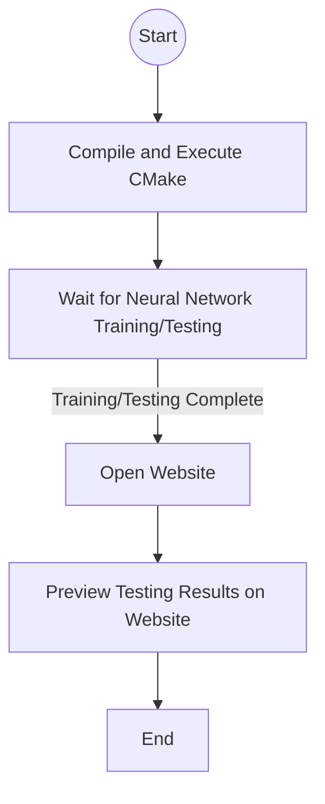
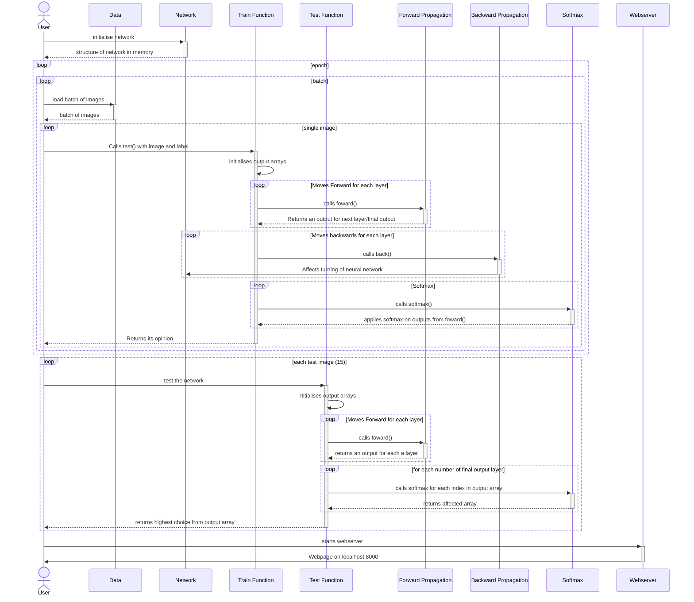
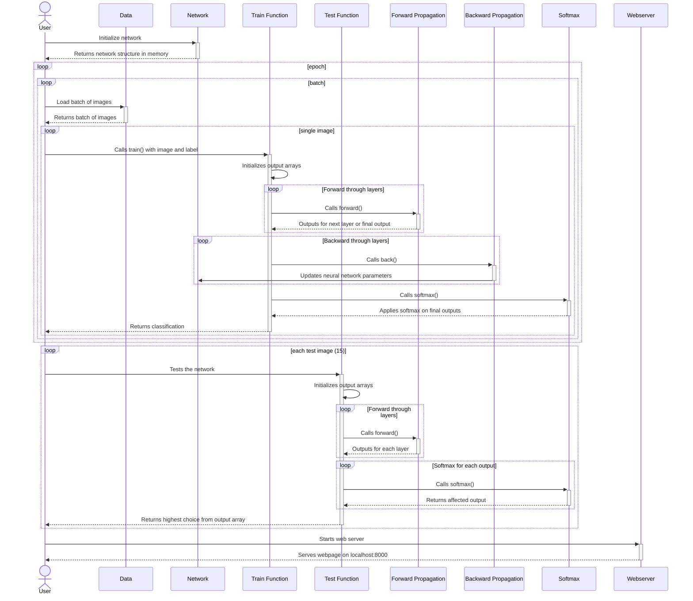
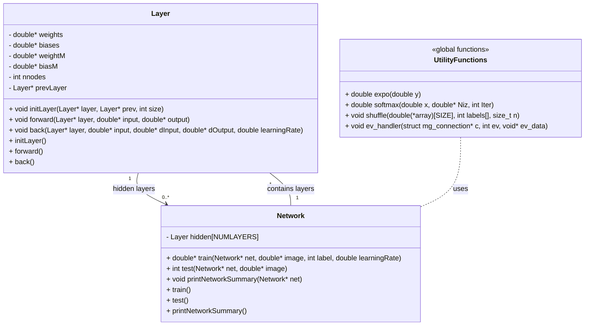

# 2024S2_SProj5_Mnistcnn
Student: 8161133. Project for Semester 2, 2024 of Structured Project (Digital Technologies).

Initial description (Week 9, Semester2): 'fully connected neural network in c . analyzing the mnist dataset of numbers https://www.kaggle.com/datasets/hojjatk/mnist-dataset'

how to run:
either use cmake or
gcc lib.c mongoose.c -o exec -lm
./exec
wait for network to finish
open localhost:8000

